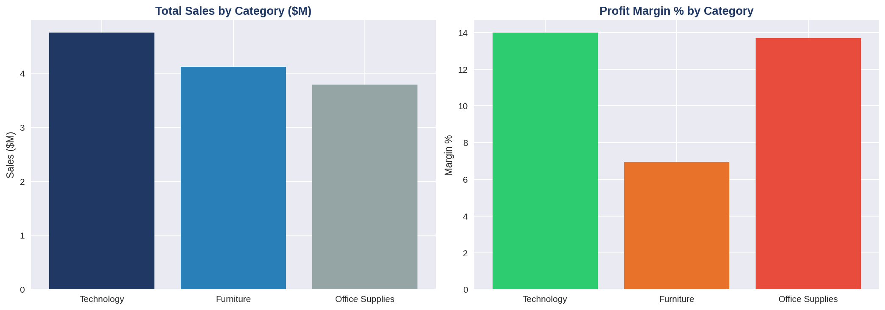
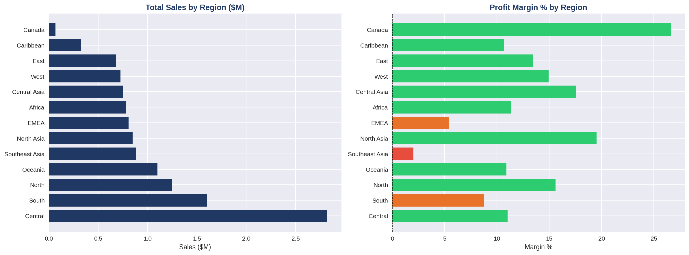
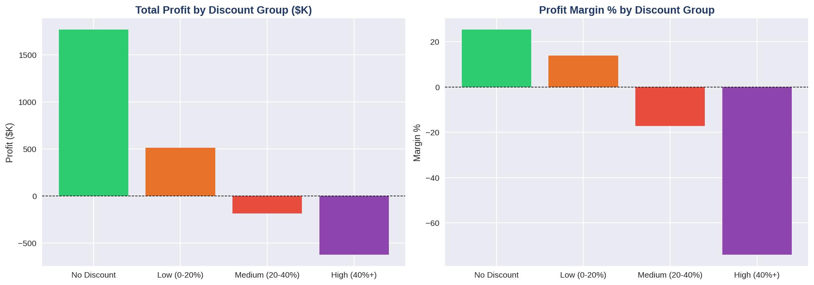
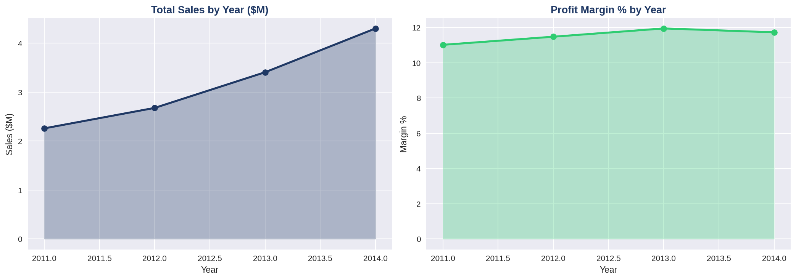
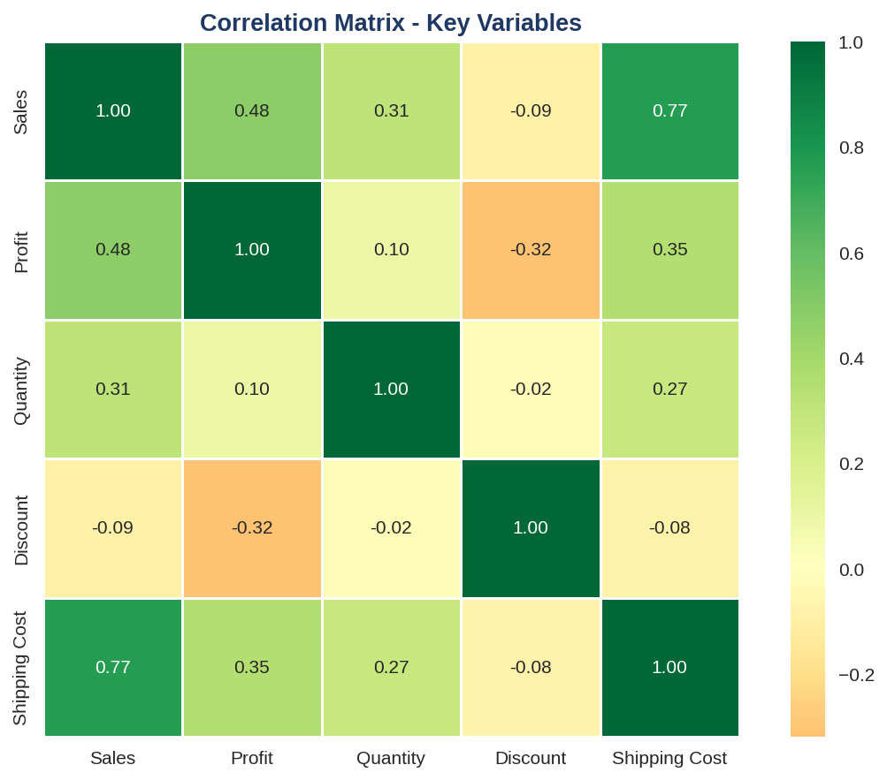
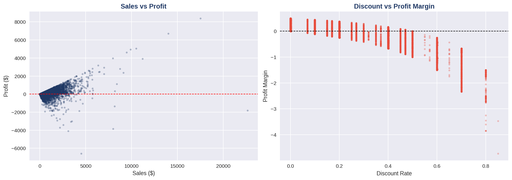
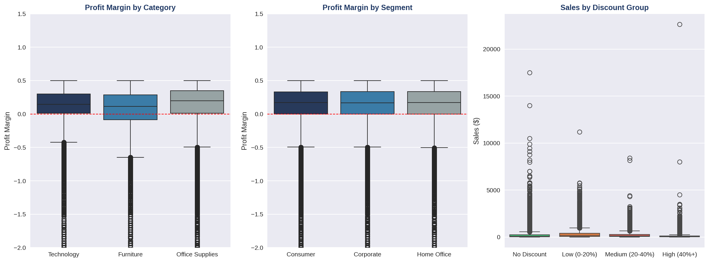
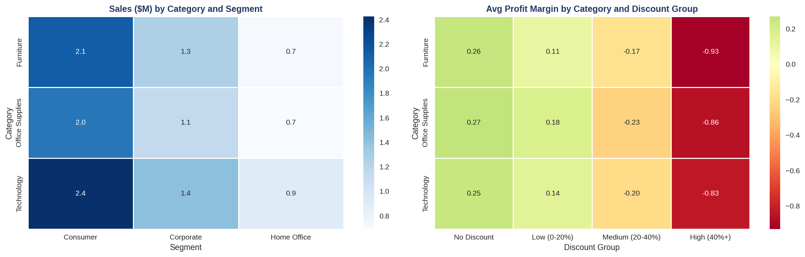

# 🛒 Superstore Global - Exploratory Data Analysis
Python | Pandas | Matplotlib | Seaborn

---

## 📌 Overview

51,290 orders. 4 years of data. One question :where is the money going ?

This project digs into the Global Superstore dataset to find out what drives profitability, what destroys it, and what management can actually do about it.

---

## 🗂️ Dataset

**Source:** [Global Superstore Dataset - Kaggle](https://www.kaggle.com/datasets/apoorvaappz/global-super-store-dataset)

- 51,290 transaction lines
- 24 variables : orders, customers, products, regions and financials
- Period : 2011 - 2014

---

## 🛠️ Tools and Skills

| Skill | Detail |
|---|---|
| **Data Loading** | pd.read_csv, encoding handling |
| **Data Cleaning** | datetime conversion, feature engineering |
| **Univariate Analysis** | groupby, agg, describe |
| **Bivariate Analysis** | corr, crosstab, mean comparison |
| **Visualization** | Matplotlib, Seaborn |
| **Chart Types** | Barplot, Lineplot, Boxplot, Heatmap, Scatter |

---

## 📊 Analysis Structure

### 🔍 Data Exploration
- Dataset shape, columns and data types
- Missing values and duplicates
- Descriptive statistics.

### 🧹 Data Cleaning
- Date conversion to datetime format
- Feature engineering : Profit Margin, Discount Group,Year, Month, Month Name.

### 📊 Univariate Analysis
- Global KPIs : Sales, Profit, Orders, Discount, Margin
- Sales and Profit by Category
- Sales and Profit by Region
- Discount Impact by Group
- Time Trends by Year
- Top and Bottom 10 Products
- Customer Segment Analysis.

### 🔗 Bivariate Analysis
- Correlation Matrix
- Scatter Plots : Sales vs Profit, Discount vs Profit Margin
- Boxplots by Category, Segment and Discount Group
- Cross Tables : Category vs Segment, Category vs Discount Group
- Mean Comparison by Group.

---

## 🔍 What the Data Actually Says

### 💸 The Discount Problem
The numbers here are hard to ignore.
Orders with no discount average 25% margin.
Once you cross 20%, the business starts losing money. 
Cross 40% and you are destroying 74 cents for every dollar you sell.

There are 6,961 orders in that last bucket and each one loses $90 on average.
That is roughly $627K in avoidable losses - sitting there, waiting to be fixed.

And here is the part that makes it worse :
discount rate correlates at -0.32 with profit but only -0.09 with sales. The discounts are not even bringing in more volume.

### 📦 The Category Gap
Technology and Office Supplies both run around 14% margin. Furniture sits at 6.94% despite an average order value of $416 - nearly as high as Technology.

The product is selling. The margin just is not following. That gap deserves a closer look.

### 🌍 The Regional Divide
Canada delivers 26.62% margin on modest volume.
North Asia and Central Asia both clear 17%.
Southeast Asia generates decent revenue but barely breaks even at 2.02%.
Same business activity, very different profitability depending on the region.

### 🏆 Product Performance
The Canon imageCLASS copier runs at 40.91% margin - the strongest in the entire catalog.

At the other end, 10 products lose money regardless of volume. The Lesro Training Table loses 95 cents per dollar sold. These are not marginal cases - they need a decision.

---

## 💡 Three Things Worth Doing

| Priority | Action |
|---|---|
| 1 | Hold discounts below 20% across all categories |
| 2 | Review Furniture pricing - the volume is there |
| 3 | Make a call on the 10 loss-making products |

---

## 📊 Visualizations

### Category Analysis


### Regional Analysis


### Discount Impact


### Time Trends


### Correlation Heatmap


### Scatter Plots


### Boxplots


### Cross Tables


---

## 📁 Repository Structure

```
Superstore-Python-EDA/
├── README.md
├── Superstore_EDA_Python.ipynb
└── assets/
    ├── category_analysis.png
    ├── regional_analysis.png
    ├── discount_analysis.png
    ├── time_trends.png
    ├── top_products.png
    ├── segment_analysis.png
    ├── correlation_heatmap.png
    ├── scatter_plots.png
    ├── boxplots.png
    └── cross_tables.png
```

---

## 🔗 Related Projects

- [Superstore - Power BI Dashboard](https://github.com/diahandahame/Superstore-PowerBI-Dashboard)
- [Superstore - Excel Dashboard](https://github.com/diahandahame/Sales-Analysis-Excel-Dashboard)
- [AdventureWorks - Advanced SQL Analysis](https://github.com/diahandahame/AdventureWorks-SQL-Analysis)

---

## 👤 Author

**Handahamé DIA** - Quantitative Economist | Business Analyst

[](https://www.linkedin.com/in/handahame-dia/)
[](https://github.com/diahandahame)
---
